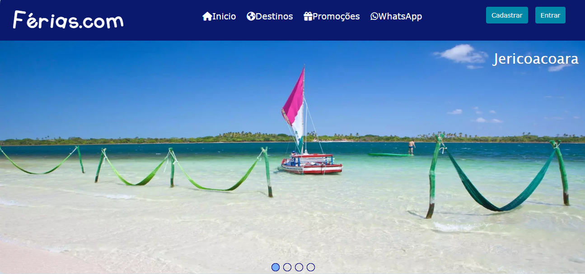
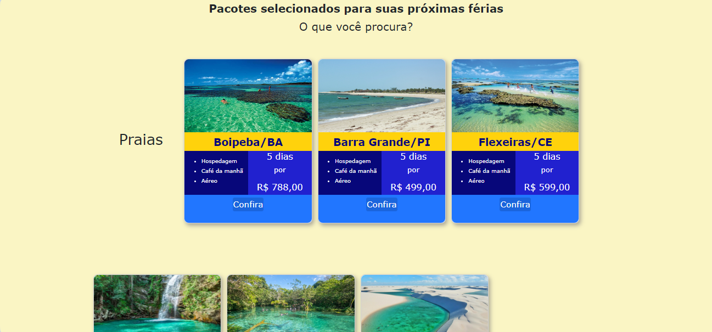
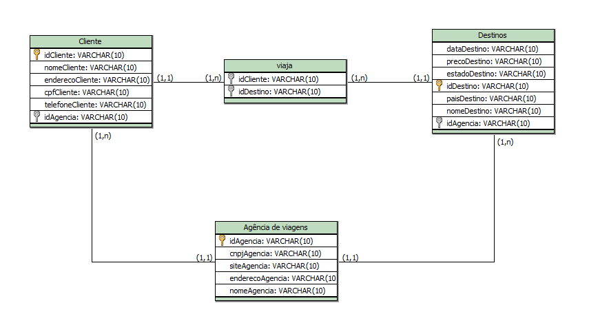
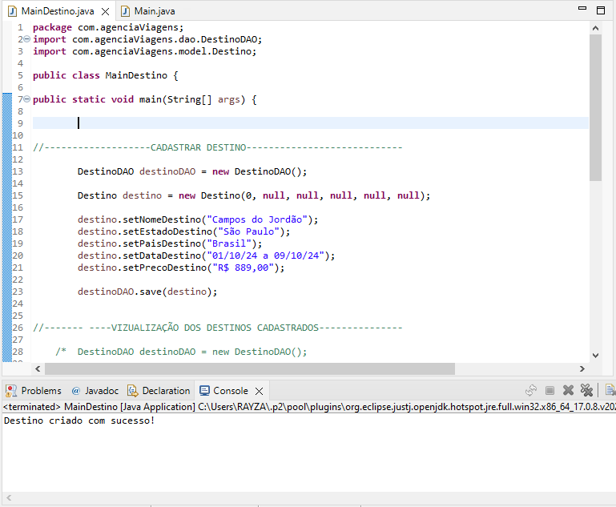
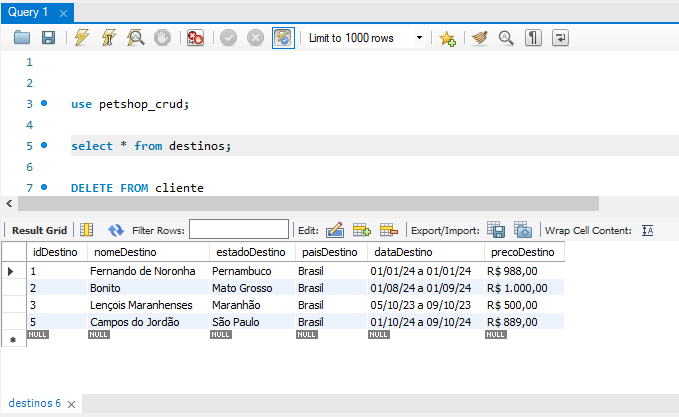

# Atividade-Pr-tica-do-M-dulo-3
## Sobre o projeto

Três projetos: um site de viagens em HTML, CSS e Bootstrapp; um modelo conceitual e lógico do banco de dados que usa SQL; e um console de agência de viagens aplicando CRUD (Create, Read, Update, Delete), utilizando as classes Java, JDBC e MySql.

Os projetos foram construídos no curso de Desenvolvedor Full Stack da Recode Pro, como requisito para obter a nota final do Módulo 3.

## Layout web

## Modelo conceitual

## CRUD Java

## Banco de dados

# Tecnologias utilizadas
## Back end
- Java
- JDBC

## Front end
- HTML / CSS / Bootstrapp

## Implantação em produção
- Back end: Eclipse
- Front end web: Visual Studio Code
- Banco de dados: MySQL

